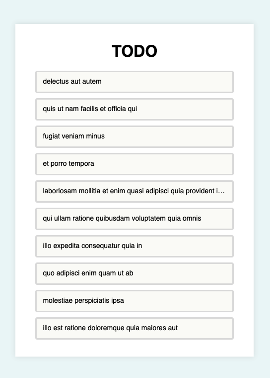

# Example: API Connection with `useEffect()`

## Master INESDI 2024 

Example for `React.useEffect()`

```jsx
export function App() {
  const [isLoading, setIsLoading] = useState(true);
  const [tasks, setTasks] = useState([]);

  useEffect(() => {
    fetchTODOList()
      .then((result) => {
        setTasks(result);
        setIsLoading(false);
      })
      .catch((error) => {
        console.error("Error fetching TODO list:", error);
        setIsLoading(false);
      });
  }, []);

  return (
    <main>
      <h1>TODO</h1>
      {isLoading ? <Loading /> : <TODOList tasks={tasks} />}
    </main>
  );
}
```

